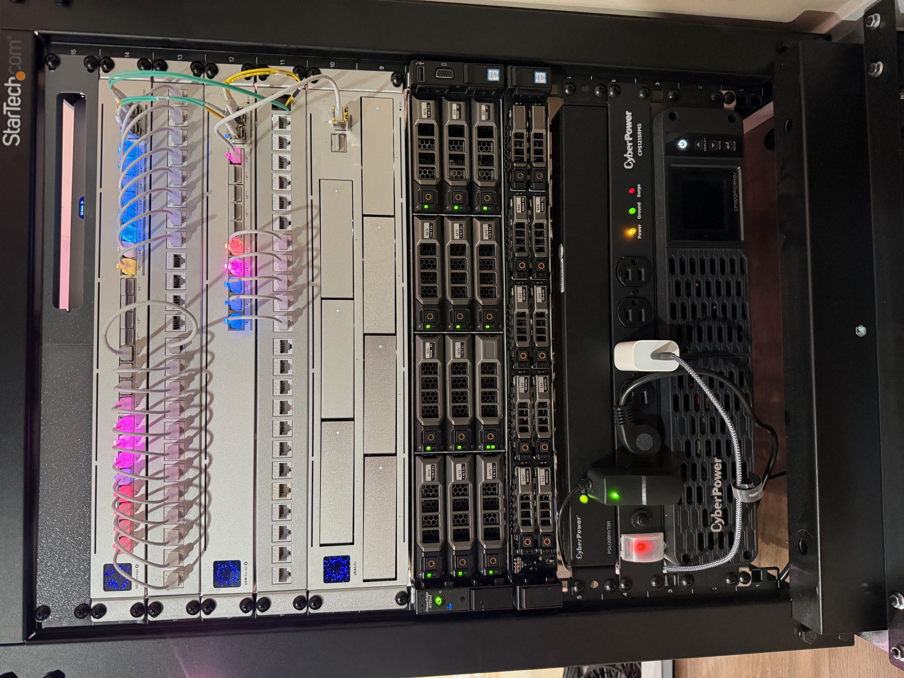
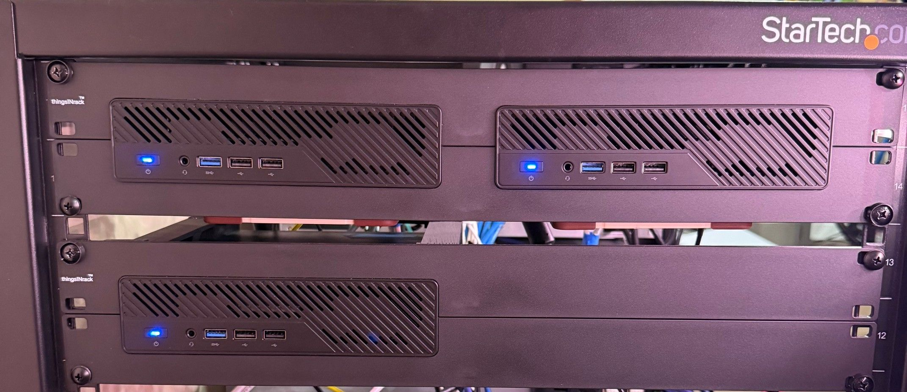

<div align="center">
  

###  My Home Operations Repository 

_... managed with Flux, Renovate, and GitHub Actions_ 

</div>

<div align="center">

[](https://discord.gg/home-operations)&nbsp;&nbsp;
[](https://talos.dev)&nbsp;&nbsp;
[](https://kubernetes.io)&nbsp;&nbsp;
[](https://fluxcd.io)&nbsp;&nbsp;
[](https://github.com/pipitonelabs/k8s-gitops/actions/workflows/renovate.yaml)

</div>

<div align="center">

[](https://status.pipitonelabs.com)&nbsp;&nbsp;
[](https://status.pipitonelabs.com)&nbsp;&nbsp;

</div>

<div align="center">

[](https://github.com/kashalls/kromgo)&nbsp;&nbsp;
[](https://github.com/kashalls/kromgo)&nbsp;&nbsp;
[](https://github.com/kashalls/kromgo)&nbsp;&nbsp;
[](https://github.com/kashalls/kromgo)&nbsp;&nbsp;
[](https://github.com/kashalls/kromgo)&nbsp;&nbsp;
[](https://github.com/kashalls/kromgo)&nbsp;&nbsp;
[](https://github.com/kashalls/kromgo)

</div>

---

##  Overview

This is a mono repository for my home infrastructure and Kubernetes cluster. I try to adhere to Infrastructure as Code (IaC) and GitOps practices using tools like [Ansible](https://www.ansible.com/), [Terraform](https://www.terraform.io/), [Kubernetes](https://kubernetes.io/), [Flux](https://github.com/fluxcd/flux2), [Renovate](https://github.com/renovatebot/renovate), and [GitHub Actions](https://github.com/features/actions).

---

##  Kubernetes

My Kubernetes cluster is deployed with [Talos](https://www.talos.dev). This is a semi-hyper-converged cluster, workloads and block storage are sharing the same available resources on my nodes while I have a separate server with ZFS for NFS/SMB shares, bulk file storage and backups.

There is a template over at [onedr0p/cluster-template](https://github.com/onedr0p/cluster-template) if you want to try and follow along with some of the practices I use here.

### Core Components

- [actions-runner-controller](https://github.com/actions/actions-runner-controller): Self-hosted GitHub runners for CI/CD workflows.
- [cert-manager](https://github.com/cert-manager/cert-manager): Automated SSL certificate management and provisioning.
- [cilium](https://github.com/cilium/cilium): High-performance container networking powered by [eBPF](https://ebpf.io).
- [cloudflared](https://github.com/cloudflare/cloudflared): Secure tunnel providing Cloudflare-protected access to cluster services.
- [envoy-gateway](https://github.com/envoyproxy/gateway): Modern ingress controller for cluster traffic management.
- [external-dns](https://github.com/kubernetes-sigs/external-dns): Automated DNS record synchronization for ingress resources.
- [external-secrets](https://github.com/external-secrets/external-secrets): Kubernetes secrets management integrated with [1Password Connect](https://github.com/1Password/connect).
- [multus](https://github.com/k8snetworkplumbingwg/multus-cni): Multi-homed pod networking for advanced network configurations.
- [rook](https://github.com/rook/rook): Cloud-native distributed storage orchestrator for persistent storage.
- [spegel](https://github.com/spegel-org/spegel): Stateless cluster-local OCI registry mirror for improved performance.
- [volsync](https://github.com/backube/volsync): Advanced backup and recovery solution for persistent volume claims.

### GitOps

[Flux](https://github.com/fluxcd/flux2) watches my [kubernetes](./kubernetes) folder (see Directories below) and makes the changes to my clusters based on the state of my Git repository.

The way Flux works for me here is it will recursively search the [kubernetes/apps](./kubernetes/apps) folder until it finds the most top level `kustomization.yaml` per directory and then apply all the resources listed in it. That aforementioned `kustomization.yaml` will generally only have a namespace resource and one or many Flux kustomizations (`ks.yaml`). Under the control of those Flux kustomizations there will be a `HelmRelease` or other resources related to the application which will be applied.

[Renovate](https://github.com/renovatebot/renovate) monitors my **entire** repository for dependency updates, automatically creating a PR when updates are found. When some PRs are merged Flux applies the changes to my cluster.

### Directories

This Git repository contains the following directories under [kubernetes](./kubernetes).

```sh
📁 kubernetes      # Kubernetes cluster defined as code
├─📁 apps          # Apps deployed into my cluster grouped by namespace (see below)
├─📁 components    # Re-usable kustomize components
└─📁 flux          # Flux system configuration
```

##  DNS

I run two instances of [ExternalDNS](https://github.com/kubernetes-sigs/external-dns) to handle DNS automation:

- **Private DNS**: Syncs records to my UCG Fiber via the [ExternalDNS webhook provider for UniFi](https://github.com/kashalls/external-dns-unifi-webhook)
- **Public DNS**: Syncs records to Cloudflare for external services

This is achieved by defining routes with two specific gateways: `envoy-internal` for private DNS and `envoy-external` for public DNS. Each ExternalDNS instance watches for routes using its assigned gateway and syncs the appropriate DNS records to the corresponding platform.

---

##  Hardware

<details>
  <summary>Click to see my rack</summary>

  
  
</details>

---

| Device                    | Count | OS Disk Size | Data Disk Size          | Ram   | Operating System | Purpose                 |
|---------------------------|-------|--------------|-------------------------|------ |------------------|-------------------------|
| MS-01 (i9-12900H)         | 3     | 1xTB m2 nvme | 1xTB m2 nvme            | 64GB  | Talos            | Kubernetes              |
| Dell R730XD               | 1     | -            | Random drive sizes      | 128GB | UnRAID OS        | NFS                     |
| UniFi UNAS Pro            | 1     | -            | 7x16TB HDD              | 8GB   | UniFi OS         | Backup of backups       |
| UniFi UCG Fiber           | 1     | -            | 1x2TB m2 nvme           | -     | UniFi OS         | Router & NVR            |
| UniFi USW Pro Max 24 PoE  | 1     | -            | -                       | -     | UniFi OS         | 1/2.5Gb PoE Switch      |
| UniFi USW Pro XG 10 PoE   | 1     | -            | -                       | -     | UniFi OS         | 10Gb PoE Switch         |
| GMKtec M5 Plus            | 1     | 1xTB m2 nvme | 1xTB m2 nvme           | 64GB  | Proxmox          | Various                 |

---

##  Gratitude and Thanks

Many thanks to my friend [@onedrop](https://github.com/onedr0p) and all the fantastic people who donate their time to the [Home Operations](https://discord.gg/home-operations) Discord community. Be sure to check out [kubesearch.dev](https://kubesearch.dev) for ideas on how to deploy applications or get ideas on what you may deploy.

---

##  Changelog

See the latest [release](https://github.com/pipitonelabs/k8s-gitops/releases/latest) notes.

---

##  License

See [LICENSE](./LICENSE).
