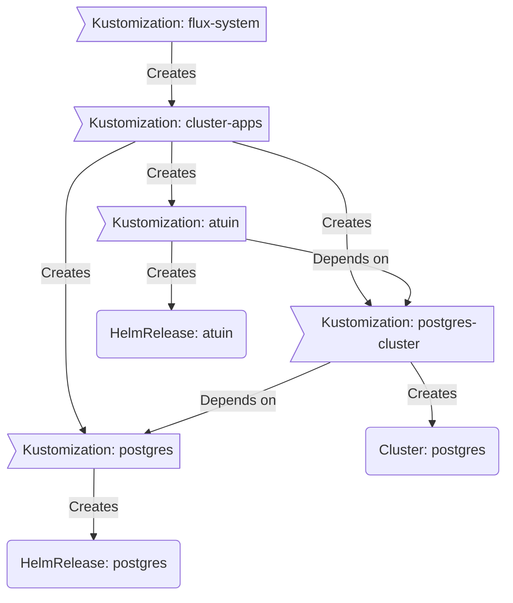

<div align="center">
  

###  My Home Operations Repository 

_... managed with Flux, Renovate, and GitHub Actions_ 

</div>

<div align="center">

[](https://discord.gg/home-operations)&nbsp;&nbsp;
[](https://talos.dev)&nbsp;&nbsp;
[](https://kubernetes.io)&nbsp;&nbsp;
[](https://fluxcd.io)&nbsp;&nbsp;
[](https://github.com/tslamars/k8s-gitops/actions/workflows/renovate.yaml)

</div>

<div align="center">

[](https://status.tslamars.com)&nbsp;&nbsp;
[](https://status.tslamars.com)&nbsp;&nbsp;
[](https://status.tslamars.com)

</div>

<div align="center">

[](https://github.com/kashalls/kromgo)&nbsp;&nbsp;
[](https://github.com/kashalls/kromgo)&nbsp;&nbsp;
[](https://github.com/kashalls/kromgo)&nbsp;&nbsp;
[](https://github.com/kashalls/kromgo)&nbsp;&nbsp;
[](https://github.com/kashalls/kromgo)&nbsp;&nbsp;
[](https://github.com/kashalls/kromgo)&nbsp;&nbsp;
[](https://github.com/kashalls/kromgo)&nbsp;&nbsp;
[](https://github.com/kashalls/kromgo)

</div>

---

##  Overview

This is a mono repository for my home infrastructure and Kubernetes cluster. I try to adhere to Infrastructure as Code (IaC) and GitOps practices using tools like [Ansible](https://www.ansible.com/), [Terraform](https://www.terraform.io/), [Kubernetes](https://kubernetes.io/), [Flux](https://github.com/fluxcd/flux2), [Renovate](https://github.com/renovatebot/renovate), and [GitHub Actions](https://github.com/features/actions).

---

##  Kubernetes

My Kubernetes cluster is deployed with [Talos](https://www.talos.dev). This is a semi-hyper-converged cluster, workloads and block storage are sharing the same available resources on my nodes while I have a separate server with ZFS for NFS/SMB shares, bulk file storage and backups.

There is a template over at [onedr0p/cluster-template](https://github.com/onedr0p/cluster-template) if you want to try and follow along with some of the practices I use here.

### Core Components

- [actions-runner-controller](https://github.com/actions/actions-runner-controller): Self-hosted Github runners.
- [cert-manager](https://github.com/cert-manager/cert-manager): Creates SSL certificates for services in my cluster.
- [cilium](https://github.com/cilium/cilium): eBPF-based networking for my workloads.
- [cloudflared](https://github.com/cloudflare/cloudflared): Enables Cloudflare secure access to my routes.
- [external-dns](https://github.com/kubernetes-sigs/external-dns): Automatically syncs ingress DNS records to a DNS provider.
- [external-secrets](https://github.com/external-secrets/external-secrets): Managed Kubernetes secrets using [1Password Connect](https://github.com/1Password/connect).
- [multus](https://github.com/k8snetworkplumbingwg/multus-cni): Multi-homed pod networking.
- [rook](https://github.com/rook/rook): Distributed block storage for peristent storage.
- [spegel](https://github.com/spegel-org/spegel): Stateless cluster local OCI registry mirror.
- [volsync](https://github.com/backube/volsync): Backup and recovery of persistent volume claims.

### GitOps

[Flux](https://github.com/fluxcd/flux2) watches my [kubernetes](./kubernetes) folder (see Directories below) and makes the changes to my clusters based on the state of my Git repository.

The way Flux works for me here is it will recursively search the [kubernetes/apps](./kubernetes/apps) folder until it finds the most top level `kustomization.yaml` per directory and then apply all the resources listed in it. That aforementioned `kustomization.yaml` will generally only have a namespace resource and one or many Flux kustomizations (`ks.yaml`). Under the control of those Flux kustomizations there will be a `HelmRelease` or other resources related to the application which will be applied.

[Renovate](https://github.com/renovatebot/renovate) monitors my **entire** repository for dependency updates, automatically creating a PR when updates are found. When some PRs are merged Flux applies the changes to my cluster.

### Directories

This Git repository contains the following directories under [kubernetes](./kubernetes).

```sh
📁 kubernetes      # Kubernetes cluster defined as code
├─📁 apps          # Apps deployed into my cluster grouped by namespace (see below)
├─📁 components    # Re-usable kustomize components
└─📁 flux          # Flux system configuration
```

### Cluster layout

This is a high-level look how Flux deploys my applications with dependencies. Below there are 3 Flux kustomizations `postgres`, `postgres-cluster`, and `atuin`. `postgres` is the first app that needs to be running and healthy before `postgres-cluster` and once `postgres-cluster` is healthy `atuin` will be deployed.



### Networking

<details>
  <summary>Click to see a high-level network diagram</summary>

  
</details>

---

##  DNS

In my cluster there are two instances of [ExternalDNS](https://github.com/kubernetes-sigs/external-dns) running. One for syncing private DNS records to my `UDM SE` using [ExternalDNS webhook provider for UniFi](https://github.com/kashalls/external-dns-unifi-webhook), while another instance syncs public DNS to `Cloudflare`. This setup is managed by creating routes with two specific gatways: `internal` for private DNS and `external` for public DNS. The `external-dns` instances then syncs the DNS records to their respective platforms accordingly.

---

| Device                    | Count | OS Disk Size | Data Disk Size          | Ram   | Operating System | Purpose                 |
|---------------------------|-------|--------------|-------------------------|------ |------------------|-------------------------|
| MS-01 (i9-12900H)         | 3     | 1 TB M.2     | 1 TB M.2                | 64GB  | Talos            | Kubernetes              |
| Dell R730XD               | 1     | -            | Random drive sizes      | 128GB | UnRAID OS        | NFS                     |
| UniFi UNAS Pro            | 1     | -            | 7x16TB HDD              | 8GB   | UniFi OS         | NFS                     |
| UniFi UDM SE              | 1     | -            | 1x3TB HDD               | -     | UniFi OS         | Router & NVR            |
| UniFi USW Pro Max 24 PoE  | 1     | -            | -                       | -     | UniFi OS         | 2.5Gb PoE Switch        |
| UniFi USW Pro Max 16 PoE  | 1     | -            | -                       | -     | UniFi OS         | 2.5Gb PoE Switch        |

---

##  Gratitude and Thanks

Many thanks to my friend [@onedrop](https://github.com/onedr0p) and all the fantastic people who donate their time to the [Home Operations](https://discord.gg/home-operations) Discord community. Be sure to check out [kubesearch.dev](https://kubesearch.dev) for ideas on how to deploy applications or get ideas on what you may deploy.

---

##  Changelog

See the latest [release](https://github.com/tslamars/k8s-gitops/releases/latest) notes.

---

##  License

See [LICENSE](./LICENSE).
